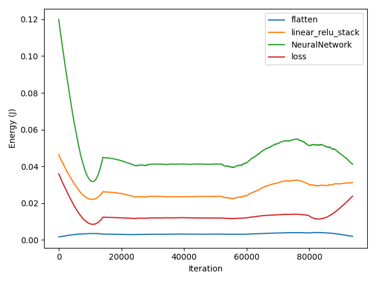
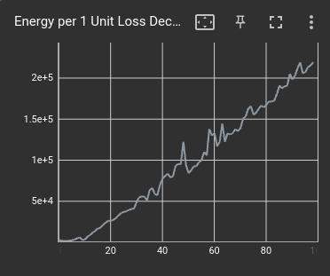

Getting started with GATorch
============================

To use GATorch simply create a ``GA`` object. You can then track the measurements of a pytorch model by simply using ``attach_model()``. With 
the latter function you can pass a model to your ``GA`` object, which will then measure the energy consumption of the model during each 
forward and backward pass.

.. code:: python3

    from GATorch import GA

    # Create the profiler object and attach a model to it
    ga_measure = GA()
    ga_measure.attach_model(model)

.. note::

    Due to `Platypus attack <https://platypusattack.com>`__ Intel RAPL requires 
    root permission for energy readings. In order to run this program with the correct
    permissions, do NOT make Intel RAPL readable for any user as this introduces 
    vulernability. Instead use Python with sudo instead:

    .. code-block:: bash
        
        ~$ sudo ./.venv/bin/python <script_name>.py

Once the model is attached to the ``GA`` object you can simply follow you normal training loop routine. GATorch will take care to create the measurements
in the background. You can then retrieve the measurements at any point. 

.. code:: python3

    # Let's try to do a single forward pass and a backward pass
    x = torch.zeros([1, 1, 28, 28]).to(device)
    y = torch.zeros([1, 10]).to(device)
    pred = model(x) # forward

    loss = loss_fn(pred, y)
    optimizer.zero_grad()
    loss.backward() # backward
    optimizer.step()

    # Now lets print the mean measurements
    print(ga_measure.get_mean_measurements())

Retrieving the measurements 
---------------------------

To retrieve the different energy consumption measurements you can use either of the following functions:

.. code:: python3
    
    ga_measure.get_mean_measurements()
    ga_measure.get_sum_measurements()
    ga_measure.get_full_measurements()

Respectively they will show the mean energy measurement of a forward or backward pass of the model, the sum of all the measurements for each pass 
and the full list of measurements. The measurements are displayed in Joules. 

You can also convert the readings into a ``pandas.DataFrame``.

.. code:: python3
    
    ga_measure.to_pandas()

+---------------------------+----------------------------+
| NeuralNetwork_forward     | NeuralNetwork_backward     | 
+===========================+============================+
| 0.031860                  | 0.042359                   |
+---------------------------+----------------------------+
| 0.042236                  | 0.034667                   | 
+---------------------------+----------------------------+

To now visualize the results use :mod:`visualize_data()`.

.. code:: python3

    ga_measure.visualize_data()
    

Tracking a model 
----------------

To start tracking a model you need to attach it to a ``GA`` object. By default the ``GA`` profiler will also track the energy consumption 
that each named layer of the model generates. If you are not intrested in this data you can specify it when attaching the model to the profiler.

.. code:: python3

    ga_measure = GA()

    ga_measure.attach_model(model_1, named_layer=False)

If you want to track the energy consumption of a new model you must first detach the previous one. Finally you can also 
attach a loss function to track the forward and backward passes of the torch loss criterion. 

.. code:: python3

    ga_measure.detach_model()
    ga_measure.attach_model(model_2, loss=loss_fn)

To reset the current energy measurements use ``reset()``.

.. code:: python3

    ga_measure.reset()

Loss vs Energy Consumption  
--------------------------

An important feature of ``GATorch`` is its ability to compute and display how much energy is needed to improve the loss of a model 
at each step of the training loop. This way it is possible to see how improving the loss becomes more expensive as the loss becomes 
smaller, giving machine learning scientist and enginners a new criterion to judge, for example, when to stop training. We show this data
using `tensorboard <https://pytorch.org/docs/stable/tensorboard.html>`__.

.. code:: python3

    ga_measure.set_tensorboard_stats()  

For more details about ``tensorboard`` integration see this :doc:`section <tensorboard>`.
