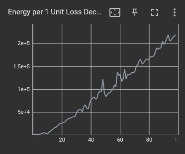

Tensorboard Integration
=======================

We set up a `tensorboard <https://pytorch.org/docs/stable/tensorboard.html>`__ dashboard to visualize the energy consumption data tracked by the profiler. After you trained your model 
tell the profiler to set up the tensorboard data using ``set_tensorboard_stats()``. 

.. code:: python3

    from GATorch import GA

    ga_measure = GA()
    ga_measure.attach_model(model)
    train(model)

    ga_measure.set_tensorboard_stats()  

You can then access the tensorboard dashboard by running the following command from the terminal.

.. code-block:: bash
    
    ~$ tensorboard --logdir=runs

Graphs
------

Under the ``Scalar`` tab of the dashboard you can see graphs indicating the energy consumption of the different components of your model through 
training. The graphs indicate the consumption during each full pass of the model or during the forward or backward pass. 

Furthermore if you attached also your torch ``loss`` function to the profiler, than the dashboard will also display how much energy is needed
to improve the loss by a constant amount. When compared to the loss graph the data can help engineers understand when the energy consumption 
is getting too high compared to the relative improvement in loss. 

Overall Consumption
-------------------

Under the ``Text`` tab of the dashboard you can see the value of the overall energy consumption of the profiled model throughout the whole 
training loop. 

.. image:: images/total_energy_text_summary.png
   :width: 600