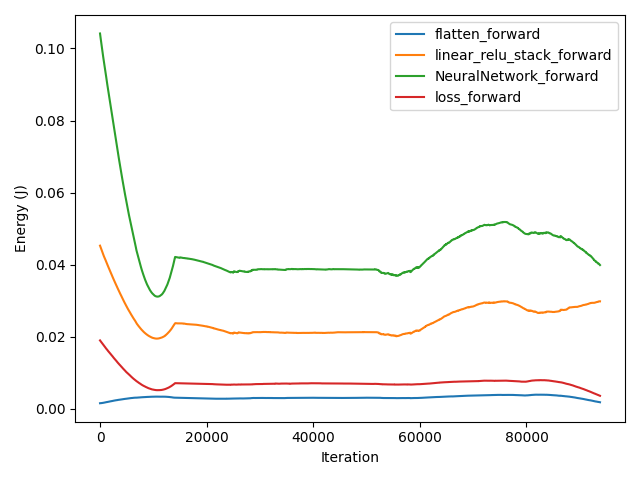
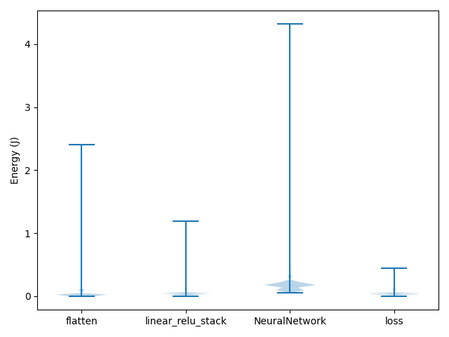

Visualize Measurements
======================

Using GATorch you can track the energy consumption of your models. To visualize the results
you can use the ``visualize_data()`` function.

.. code:: python3

    from GATorch import GA

    ga_measure = GA()
    ga_measure.attach_model(model)
    train(model)

    ga_measure.visualize_data()  

.. image:: images/plotenergy.png
   :width: 600

You can use the function to specify if you want to see the energy consumption of the model
during a forward pass or a backward pass. Furthermore if you attached also a loss function
to the profiler you can also see the consumption of the loss computation. Finally 
you can specify which named layers you are intrested in seeing. 

.. code:: python3

    ga_measure.visualize_data(layers=[], loss=True, phase='forward')  

If you are intrested in seeing the distribution of energy consumption the model consumes 
during a batch pass you can also visualize a violinplot or a boxplot.

.. code:: python3

    ga_measure.visualize_data(kind='violin', loss=True)  

